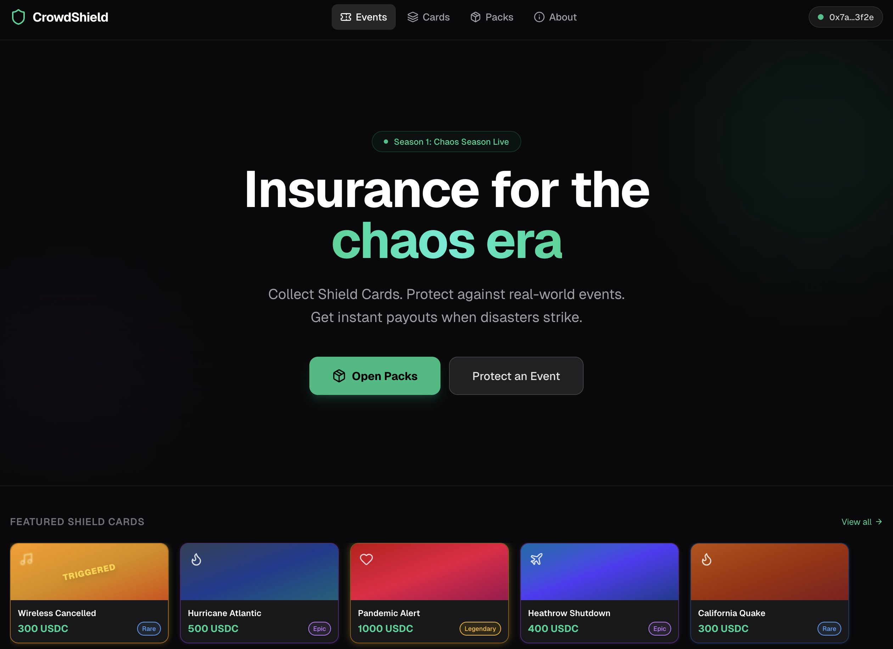
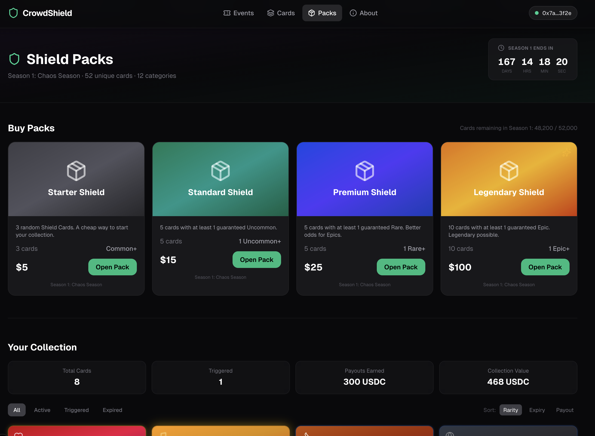
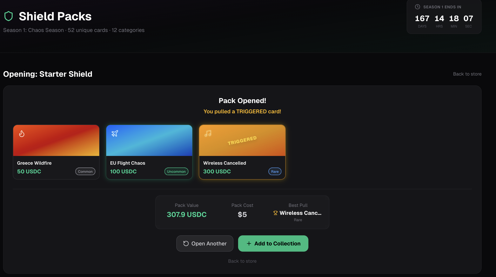
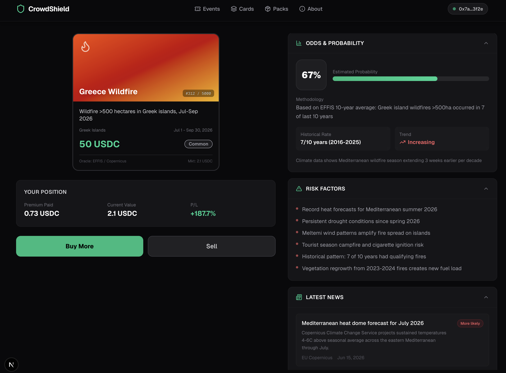
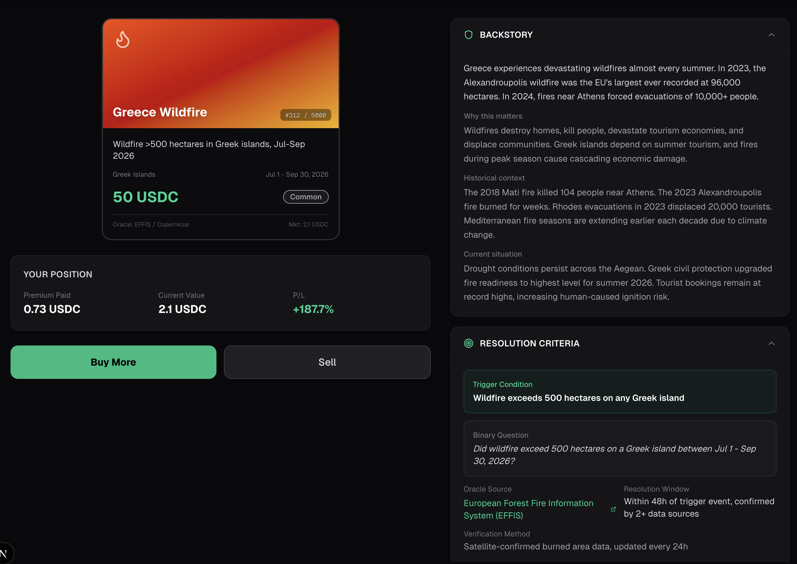
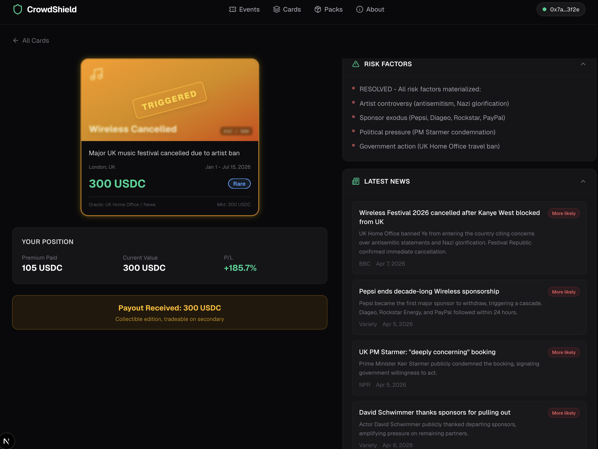
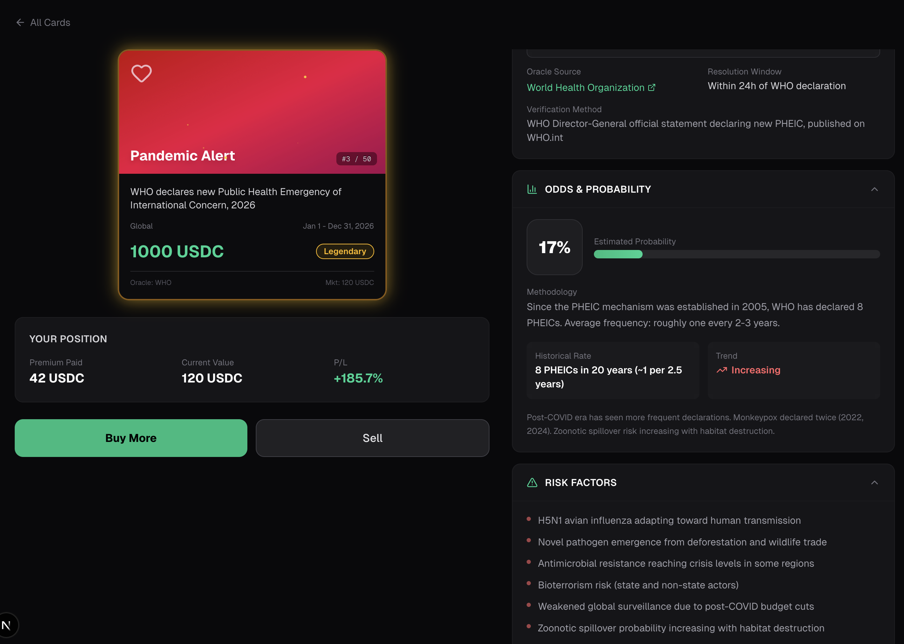
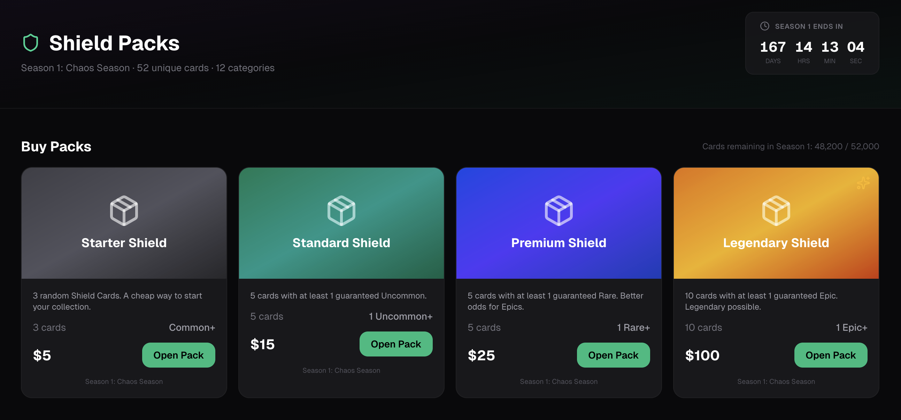

# CrowdShield

Parametric event insurance on Solana, gamified as collectible Shield Cards.

**$6.5B insurance market meets $24B gaming market. Nobody under 35 buys insurance. They will buy Shield Packs.**

## Product

Two products, one protocol:

1. **Shield Packs** - Booster packs containing random Shield Cards. Each card = parametric micro-insurance on a real-world event (wildfire, flight chaos, festival cancellation). Binary trigger, oracle confirms, instant payout.

2. **Event Shields** - Specific event protection. Buy cover for a concert/festival. Bonding curve pricing (early = cheap). Cover = tradeable NFT. Event cancelled = 3-second payout.

## Screenshots

### Home - "Insurance for the chaos era"


### Shield Packs Store


### Pack Opening - cards revealed with rarity animation


### Card Detail - Greece Wildfire (67% probability, EFFIS oracle, 10-year data)


### Card Detail - backstory, resolution criteria, news feed


### Wireless Festival - TRIGGERED, 300 USDC payout


### Pandemic Alert - Legendary card, 17% probability, WHO oracle


### Your Collection - 8 cards, 300 USDC triggered, 468 USDC value


## Architecture

```
crowdshield/
├── programs/crowdshield/     # Anchor smart contracts (Solana)
│   └── src/
│       ├── lib.rs            # Program entry, 9 instructions
│       ├── state.rs          # Event, CoverPool, Cover, Ticket, LpPosition
│       ├── errors.rs         # Custom error codes
│       └── instructions/     # Instruction handlers
│           ├── create_event.rs       # Organizer creates event + stakes bond
│           ├── mint_ticket.rs        # Fan buys ticket (USDC -> organizer vault)
│           ├── buy_cover.rs          # Fan buys cover (bonding curve pricing)
│           ├── deposit_liquidity.rs  # LP deposits USDC into cover pool
│           ├── resolve.rs            # Authority resolves cover outcome
│           ├── claim_payout.rs       # Cover holder claims payout after YES
│           ├── update_controversy.rs # Oracle updates controversy score
│           ├── withdraw_liquidity.rs # LP withdraws after resolution
│           └── claim_bond.rs         # Bond return or slash
├── app/                      # Next.js 16 frontend
│   └── src/
│       ├── app/              # Routes: home, packs, cards, card/[id], event/[id], about
│       ├── components/       # 13 components (PackOpener, ShieldCard, ControversyGauge, etc.)
│       └── lib/              # Types, mock data, 12 Shield Cards, cover pricing
├── pitch/                    # Pitch materials
│   ├── PITCH.md              # 20-slide deck with market data + academic citations
│   ├── PITCH_3MIN.md         # Word-for-word 3-min pitch script
│   ├── PITCH_TODAY.md        # Online pitch: 5 screens, ambient style, 3 min
│   ├── DEMO_SCRIPT.md        # 5-min demo walkthrough
│   ├── GAME_THEORY.md        # Mechanism design analysis
│   └── RHETORIC.md           # Rhetorical strategy
├── tests/                    # Anchor tests
│   └── crowdshield.ts        # Full lifecycle: create, ticket, cover, resolve, payout
└── docs/screenshots/         # Product screenshots
```

## Smart Contract Design

**Accounts:** Event, CoverPool, Cover, Ticket, LpPosition

**Key mechanics:**
- **Bonding curve pricing**: premium = f(base_rate, controversy_score^2, demand^3, 1/sqrt(time_to_event)). Fixed-point integer math (1e6 precision)
- **Ticket-gated covers**: Only ticket holders can buy cover (insurable interest = regulatory defense)
- **Pool capacity**: 80% utilization cap, bonding curve prevents drain
- **Organizer bond**: Min 2% of gross ticket revenue, slashed on cancellation
- **Per-cover-type resolution**: Bitmask tracking (resolved_mask/outcome_mask) for independent resolution of 5 cover types
- **Pro-rata LP math**: Withdrawal = (lp_deposited / total_deposits) * vault_balance. Correctly distributes premiums and losses across multiple LPs
- **On-chain bond slash**: Bond outcome read from on-chain resolution state, not caller input

## Frontend

12 fully researched Shield Cards across 6 categories (natural disasters, travel, events, health, geopolitical, crypto). Each card has:
- Real oracle sources (EFFIS, USGS, NOAA, Eurocontrol, WHO)
- Historical probability estimates from 10+ year datasets
- News items with impact assessment
- Full backstory and resolution criteria

Pack opening with rarity-based animations, 3D card flip, screen flash on rare pulls.

## Setup

### Prerequisites
- Rust + Solana CLI + Anchor CLI
- Node.js 18+

### Smart Contracts
```bash
anchor build
anchor test
```

### Frontend
```bash
cd app
npm install
npm run dev
# Open http://localhost:3000
```

## Tech Stack

- **Chain**: Solana (devnet)
- **Contracts**: Anchor 0.30.1
- **Frontend**: Next.js 16, React 19, Tailwind CSS 4, Framer Motion
- **Oracles**: Switchboard VRF (planned), multi-source data feeds
- **Token**: SPL Token (USDC)

## Colosseum Hackathon Submission

Built for [Colosseum](https://arena.colosseum.org). First parametric event insurance protocol in the Solana ecosystem.

## License

MIT
